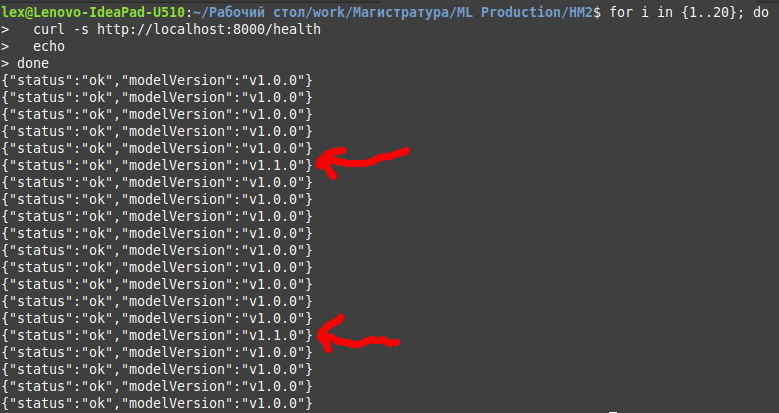

## Домашнее задание 3. Настройка стратегий развертывания модели
Автор: *Зырянов Алексей Николаевич*, М08-401НД, 14.12.2025

### ML Model Deployment with Canary Strategy

Развертывание ML-модели в продакшн с использованием Docker, Docker Compose, Nginx и ~~GitHub Actions~~, а также реализацию стратегии безопасного деплоя Canary Deployment.

В рамках проекта используется REST API для инференса ML-модели и проверки состояния сервиса.

### Структура проекта

```
.
├── data
│   └── data.csv
├── docker-compose.yml
├── Dockerfile
├── models
│   ├── model_1.1.pkl
│   └── model.pkl
├── nginx
│   └── nginx.conf
├── protos
│   ├── __init__.py
│   ├── model_pb2_grpc.py
│   ├── model_pb2.py
│   ├── model.proto
├── README.md
├── requirements.txt
├── server
│   ├── main.py
├── train_model.py
```

### Описание решения.

- ML-сервис реализован в виде REST API
- Модель загружается из файла (.pkl), имя файла передаётся через переменную окружения `MODEL_PATH`
- Версия модели передаётся через переменную окружения `MODEL_VERSION`
- Сервис упакован в Docker-контейнер
- ~~Развертывание автоматизировано через GitHub Actions~~
- Реализована стратегия Canary Deployment с помощью Nginx

### Стратегия деплоя

**Blue-Green + Canary**

Файл `docker-compose.yml` объединяет в себе `blue` и `green` версии сервиса:

- blue - стабильная версия модели (v1.0.0)
- green - новая версия модели (v1.1.0)

Обе версии работают одновременно.

**Canary Deployment**

Балансировщик Nginx распределяет входящий трафик между версиями:

- 90% запросов → blue
- 10% запросов → green

Распределение трафика происходит автоматически и случайным образом за счёт весов серверов в конфигурации Nginx.
При обнаружении ошибок новая версия может быть мгновенно отключена (rollback).

### Сборка и запуск всех сервисов

```bash
docker compose up --build
```

Будут запущены:

- ml-blue (v1.0.0)
- ml-green (v1.1.0)
- nginx (порт 8000)

### Проверка состояния сервиса и балансировки

```bash
for i in {1..20}; do
  curl -s http://localhost:8000/health
done
```


