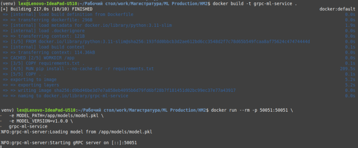
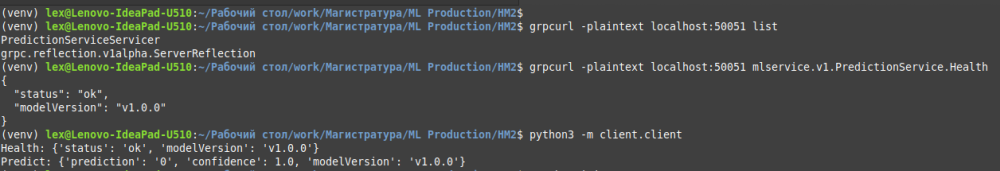

## Домашнее задание 2. Реализация /health и /predict эндпоинтов в gRPC-сервисе
Автор: *Зырянов Алексей Николаевич*, М08-401НД, 07.12.2025

Минимальный gRPC ML-сервис с двумя эндпоинтами:

- `/health` — проверка статуса и версии модели
- `/predict` — предсказание и confidence для вектора признаков

### Структура проекта

```
├── protos/
│ ├── _ _init__.py
│ ├── model.proto
│ ├── model_pb2.py
│ └── model_pb2_grpc.py
├── server/
│ └── server.py
├── client/
│ └── client.py
├── models/
│ └── model.pkl
├── data/
│ └── data.csv
├── requirements.txt
├── Dockerfile
├── .dockerignore
└── README.md
```

### Модель.

В проекте используется очень сложная и большая модель предсказывающая нолик или единичку на основе пяти взятых с потолка вещественных чисел (data/data.csv).

### Окружение и зависимости

```bash
python3 -m venv ./venv
source venv/bin/activate
pip3 install -r requirements.txt
```

### Генерация контрактный файлов

python -m grpc_tools.protoc \
  -I. \
  --python_out=. \
  --grpc_python_out=. \
  protos/model.proto

### Сборка и запуск контейнера

```bash
docker build -t grpc-ml-service .

docker run --rm -p 50051:50051 \
  -e MODEL_PATH=/app/models/model.pkl \
  -e MODEL_VERSION=v1.0.0 \
  grpc-ml-service
```



### Тест со стороны клиентов

```bash
grpcurl -plaintext localhost:50051 mlservice.v1.PredictionService.Health

python3 -m client.client

```


