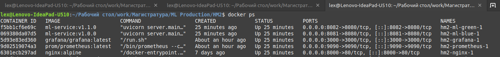
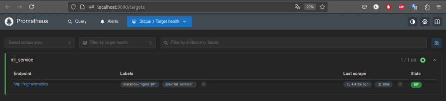
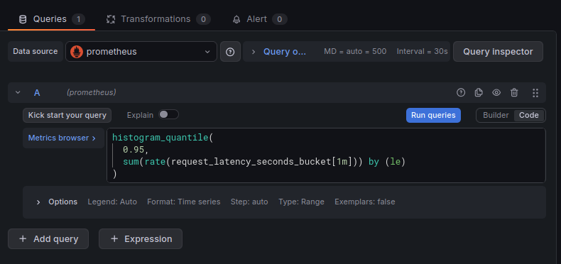
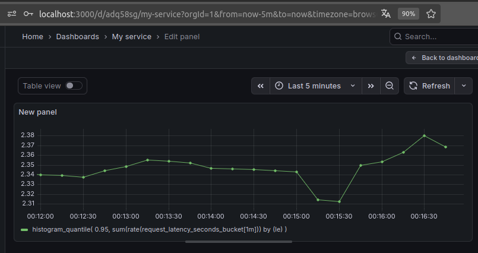
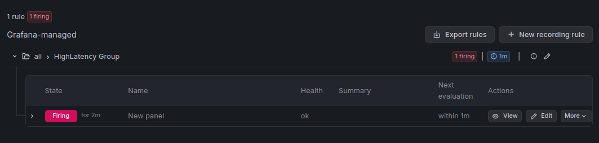
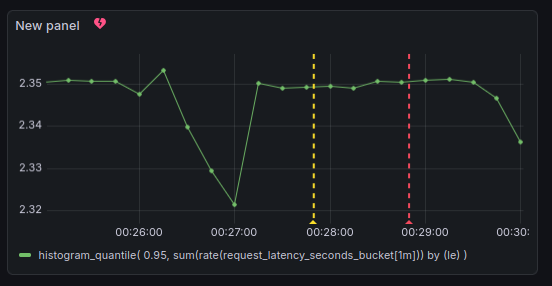

# Домашнее задание 4. Настройка алертинга в Grafana при нарушении SLO
Автор: *Зырянов Алексей Николаевич*, М08-401НД, 21.12.2025

## Цель

Настроить базовую систему мониторинга и алертинга для ML-сервиса с использованием Prometheus и Grafana. Реализовать SLO и автоматический алерт при его нарушении.

---

## Выбранный SLO

**Latency SLO:** p95 latency для эндпоинта `/predict` должна быть **меньше 1 секунды**.

---

## Стек

* FastAPI - ML-сервис
* Prometheus - сбор метрик
* Grafana - визуализация и алертинг
* Docker / docker-compose

---

## Шаги выполнения

### 1. Инфраструктура

В существующий `docker-compose.yml` добавлены сервисы:

* `prometheus`
* `grafana`

Все сервисы запускаются в одной Docker-сети.

**Скриншот:**



---

### 2. Метрики в FastAPI

В ML-сервисе:

* добавлен эндпоинт `/metrics`
* добавлена Prometheus Histogram-метрика `request_latency_seconds`
* в обработчике `/predict` добавлена случайная задержка (рандомная `sleep`) для генерации латентности и тестирования алерта

Метрики корректно экспортируются и доступны для сбора.

---

### 3. Prometheus

Prometheus настроен на сбор метрик с сервиса через `/metrics`.

Проверка:

* таргет отображается как **UP**
* ошибок скрейпинга нет

**Скриншот:**



---

### 4. Подключение Prometheus к Grafana

В Grafana добавлен источник данных Prometheus.

Соединение успешно, запросы выполняются.

**Скриншот:**


---

### 5. Метрика latency

В Prometheus доступна Histogram-метрика:

* `request_latency_seconds_bucket`

Используется для расчёта p95 latency.

**Скриншот:**



---

### 6. Дашборд Grafana

В Grafana создан дашборд с панелью, отображающей p95 latency.

Используемый PromQL-запрос:

```
histogram_quantile(
  0.95,
  sum(rate(request_latency_seconds_bucket[1m])) by (le)
)
```

**Скриншот:**



---

### 7. Alert Rule

В Grafana настроен Alert Rule:

* условие: p95 latency > 1 секунды
* длительность: более 1 минуты
* evaluation interval: 1 минута

Алерт успешно переходит в состояние **Firing** при нарушении SLO.

**Скриншоты:**





---

## Тестирование алерта

Для генерации нагрузки использовалась команда:

```bash
for i in {1..20000}; do
  curl -X POST http://localhost:8000/predict \
  -H "Content-Type: application/json" \
  -d '{"features":[1,2,3,4,3]}'
done
```

"Нагрузка" вызывает рост latency и срабатывание алерта.

---

## Результат

* Prometheus и Grafana успешно развернуты
* SLO сформулирован и реализован
* Метрики собираются и визуализируются
* Alert Rule корректно срабатывает при нарушении SLO
